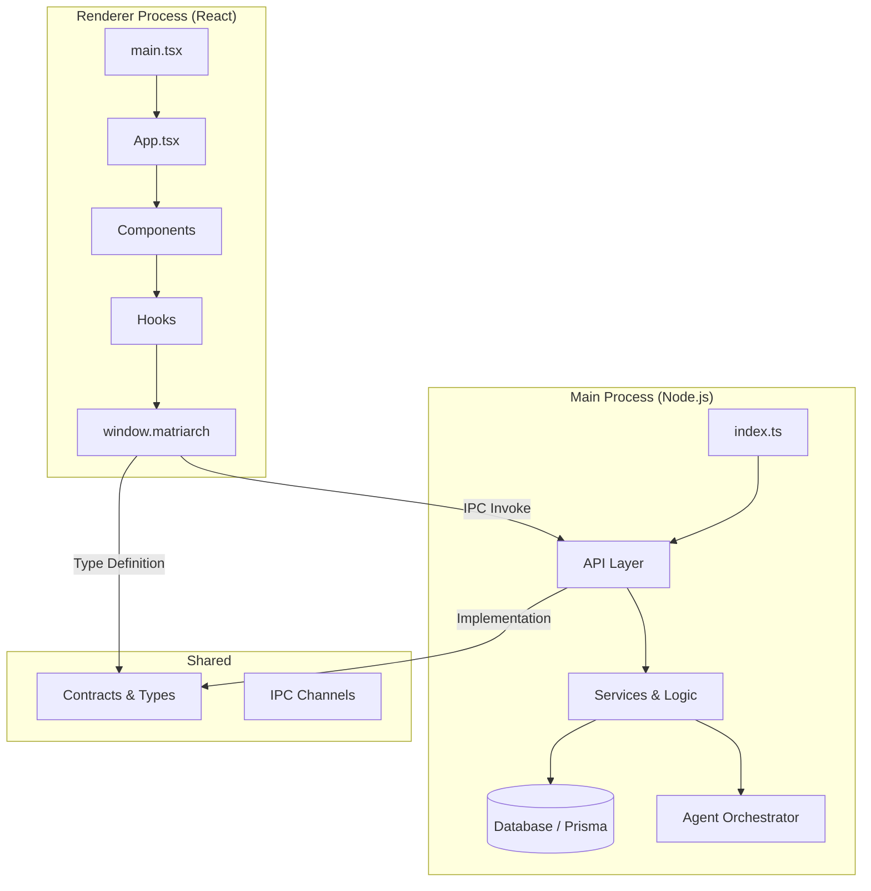

# Matriarch System Conventions

## 1. System Architecture

Matriarch follows a clean **Electron** architecture with strict separation of concerns.

### 1.1 Process Boundaries
- **Main Process**: Handles all business logic, database access, file system operations, and heavy computation (agents).
- **Renderer Process**: Pure UI layer. **NO** direct Node.js access. **NO** database access. All actions via IPC.
- **Preload Script**: The **only** bridge. Exposes a typed `window.matriarch` API.

---

## 2. IPC & API Layer

We use a strong-typed IPC pattern to ensure type safety across process boundaries.

### 2.1 File Structure
- `src/shared/api/channels.ts`: Constant strings for IPC channels. **Single source of truth** for channel names.
- `src/shared/api/contracts.ts`: TypeScript interfaces defining the API. **Single source of truth** for types.
- `src/main/api/[domain]Api.ts`: Main process implementations.
- `src/preload/index.ts`: Exposes the API to the renderer.

### 2.2 Adding a New API Feature
1. **Define** the contract in `src/shared/api/contracts.ts`.
2. **Add** channel constants in `src/shared/api/channels.ts`.
3. **Implement** the handler in `src/main/api/[domain]Api.ts`.
4. **Register** the handler in `src/main/api/index.ts`.
5. **Expose** it in `src/preload/index.ts`.

---

## 3. Coding Standards

### 3.1 Naming Conventions
- **Files/Folders**:
  - Components: `PascalCase.tsx` (e.g., `NoteCard.tsx`)
  - Utilities/Hooks: `camelCase.ts` (e.g., `useNavigation.ts`)
  - Classes: `PascalCase`
- **Variables/Functions**: `camelCase`
- **Constants**: `UPPER_SNAKE_CASE`
- **Interfaces/Types**: `PascalCase` (No `I` prefix)

### 3.2 TypeScript
- **Strict Mode**: Enabled. No `any` unless absolutely necessary and documented.
- **Exports**: Named exports preferred over default exports for utilities and components.

### 3.3 React Components
- **Functional Components**: Use `React.FC` or functional declarations.
- **Props**: Define strict interfaces for props.
- **Hooks**: Logic should be extracted to custom hooks (`use[Feature]`) if it exceeds 20 lines or handles complex state.

---

## 4. Tech Stack

- **Runtime**: Electron + Node.js
- **Frontend**: React + Vite
- **Language**: TypeScript
- **Styling**: Tailwind CSS
- **Database**: SQLite (via LibSQL) + Prisma ORM
- **Testing**: Vitest (Unit) + Playwright (E2E)

---

## 5. Agent System

- Agents are **background workers** coordinated by the `AgentOrchestrator`.
- Agents **MUST** be audited. All actions are logged via Prisma.
- Agents **MUST NOT** bypass the API layer constraints.
